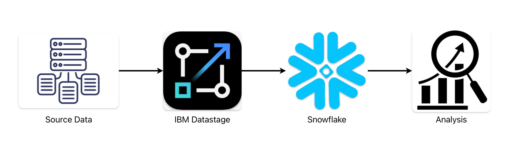
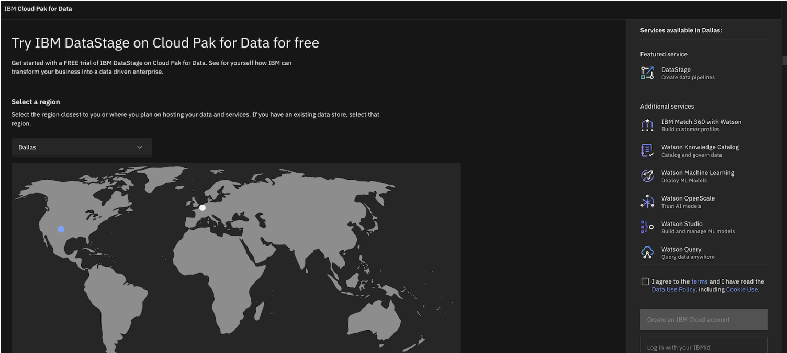
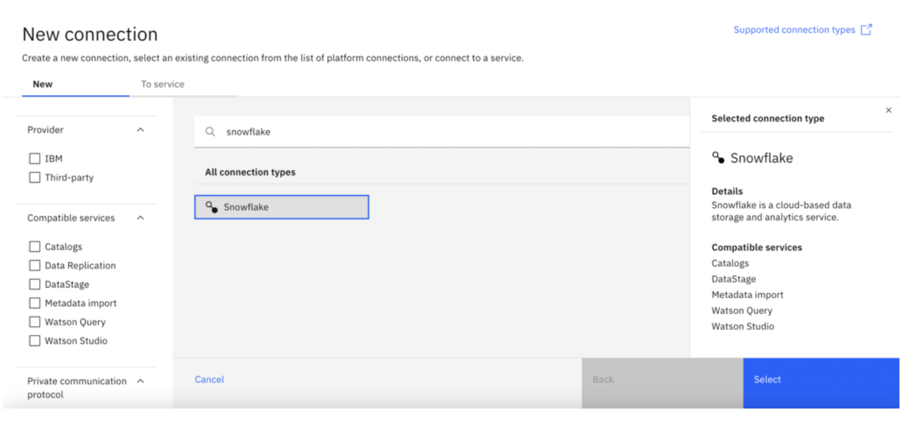
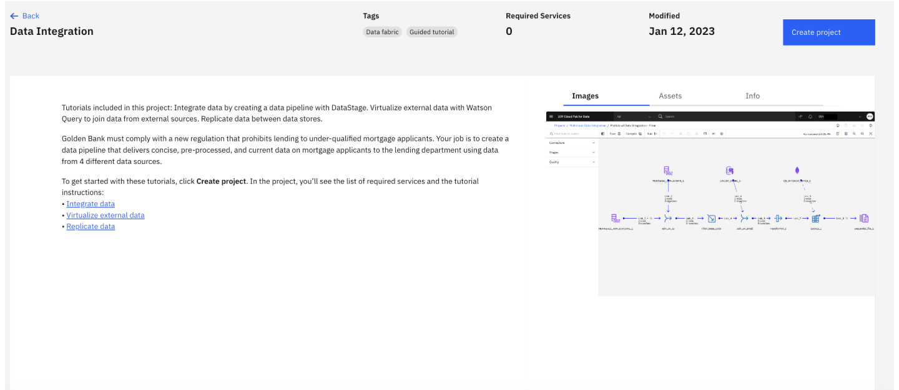
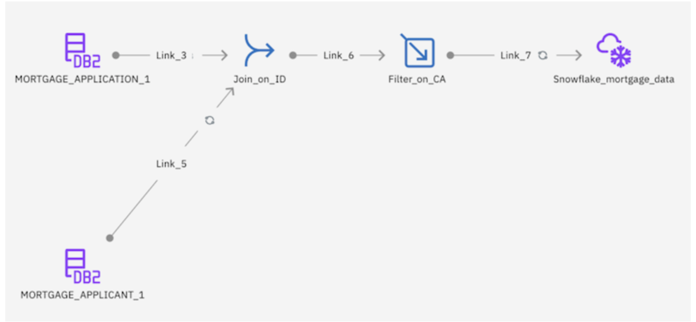
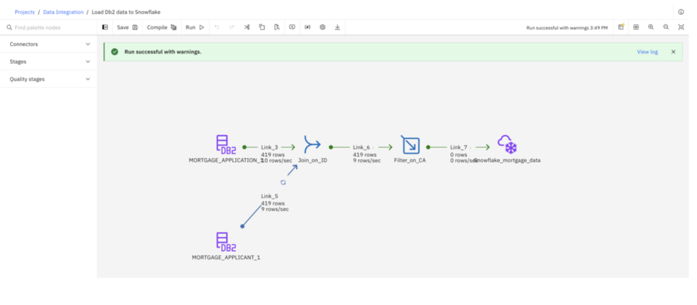
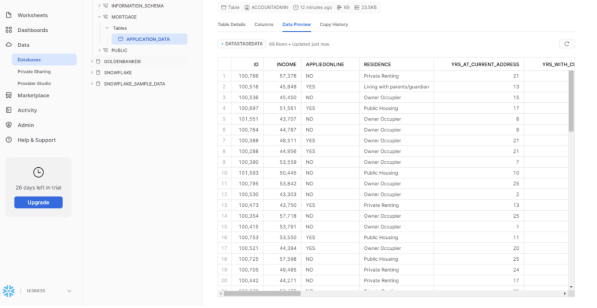

# Banking-Data-Integration-Snowflake
End-to-end data integration project using IBM DataStage and Snowflake. Demonstrates loading enterprise data from Db2 Warehouse to Snowflake.

## 📝 Project Overview
This project demonstrates an **end-to-end data integration process** by building a **DataStage flow** that extracts enterprise data from **Db2 Warehouse**, transforms it, and loads it into a **Snowflake data warehouse**. The objective was to showcase the use of **IBM DataStage** for creating robust data pipelines using modern cloud technologies.

  
*Data Integration Workflow: Source Data → IBM DataStage → Snowflake → Analysis*
---

## 🎯 Objective
The goal of this project was to:

- Load enterprise banking data from **Db2 Warehouse** to **Snowflake**.
- Apply basic data transformation and filtering during the process.
- Demonstrate the use of **DataStage** as an ETL tool for cloud-based data integration.

---

## 🛠 Tools & Technologies Used

- **IBM DataStage**: For creating data integration flows.
- **Snowflake**: Cloud data warehouse to store and analyze data.
- **Db2 Warehouse**: Source data for the project.
- **SQL**: For data transformations.
- **Cloud Pak for Data as a Service**: Platform for provisioning and managing DataStage.

---

## 📋 Steps to Achieve the Objective

1. **Provision the necessary services**: Set up accounts in **IBM Cloud Pak for Data** and **Snowflake**.

*Signing up for IBM Cloud Pak for Data*

2. **Create a Snowflake data warehouse**: Set up a warehouse, database, and schema in **Snowflake**.

*Creating a connection to Snowflake in DataStage*

3. **Create a DataStage project**: Use **Cloud Pak for Data** to create a new **DataStage project**.

*Creating a DataStage project in Cloud Pak for Data*

4. **Design the DataStage flow**:
   - Add connectors for **Db2 Warehouse** and **Snowflake**.
   - Apply transformations using **Join** and **Filter** nodes.
   - Configure runtime settings to handle **schema drift**.
  
 
*Designing the DataStage flow*  

5. **Execute the DataStage job** to load data from **Db2 Warehouse** to **Snowflake**.

*Running the DataStage job*

6. **View the data asset in Snowflake** to confirm successful data loading.

*Viewing the loaded data in Snowflake*

---

## 📈 Advantages of Using IBM DataStage with Snowflake

- **Scalable data integration**: Easily handle large volumes of data from different sources.
- **Schema drift handling**: Flexibility to manage dynamic changes in data structure.
- **End-to-end automation**: Build complete data pipelines with minimal manual intervention.
- **Cloud-native solution**: Leverage the power of **cloud platforms** for data warehousing and analytics.

---

## 🧪 Outcomes

By completing this project, we demonstrated:

- An understanding of **modern data pipelines**.
- Practical knowledge of **Snowflake** and **IBM DataStage**.
- The ability to **automate data ingestion and transformation workflows** in a cloud environment.

---

## 📚 Conclusion

- This project demonstrated how to create an **end-to-end data integration pipeline** using **IBM DataStage** and **Snowflake**. By completing this project, we successfully loaded enterprise banking data from **Db2 Warehouse** into **Snowflake**, applying transformations along the way. This workflow showcases the power of **cloud-native ETL tools** to handle large volumes of data efficiently.

- The skills gained from this project—such as **setting up data connections**, **handling schema drift**, and **performing data transformations**—are highly valuable for building **scalable, modern data pipelines** in cloud environments.

- We encourage further exploration of **Snowflake's advanced capabilities** and **IBM DataStage's pre-built transformations** to build more complex data flows.

